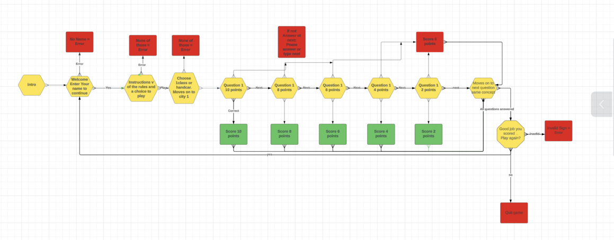
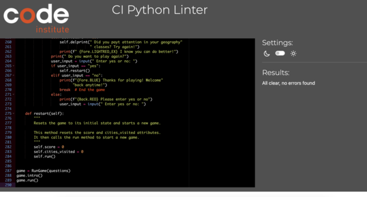
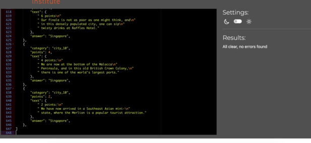

Track Quiz

Welcome to Track Quest!\
This is a Trivia Quiz which will take you on journeys across the world.\
It´s inspired from the swedish tv-show "På Spåret".\
You will visit 5 random cities and every city has 5 levels/questions.\
Decreasing from 10 points down to 2 points.\
Your mission is to guess which the city is.\
You will be given cluess on every level which gets easier and easier.\
You have only one guess per destination so use it wisely!\
A wrong answer will give you 0 points.\
So if your ready to visit exciting cities across the world\
and get exciting and learning facts try it out

# Content

**Table of content:**

- [Introduction](#introduction)
  - [Am I Responsive](#responsive)
- [UX](#ux)
  - [The Strategy](#the-strategy)
  - [The Scope](#the-scope)
  - [The Structure](#the-structure)
  - [The Skeleton](#the-skeleton)
  - [The Surface](#the-surface)
- [User Experience](#user-experience)
  - [First Time User](#first-time-user)
  - [Returning User](#returning-user)
  - [Frequent User](#frequent-user)
  - [Design](#design)
- [Features](#features)
  - [The Main Page 1](#maine-page1)
- [Technologies](#technologies)
  - [Languages](#languages)
  - [Tools](#tools)
  - [Frameworks & Libaries](#frameworks-libaries)
- [Testing](#testing)
  - [Manual Testing](#manual-testing)
  - [Lighthouse](#lighthouse)
  - [Browser Test](#browser-test)
  - [Validation](#validation)
  - [Bugs](#bugs)
- [Deployment](#deployment)
  - [Deployment To Github](#deployment-to-github)
  - [Deployment To Heroku](#deployment-to-heroku)
- [Credit](#credit)
  - [Content](#credit-content)
  - [Images](#def2)
  - [Thank You](#def)

<a id="responsive">

### Am I Responsive?

<a id="ux">

## UX

<a id="the-strategy">

### The Strategy

- Embark on a thrilling adventure with our trivia game inspired by the Swedish TV show "På Spåret."
- The aim is to create an engaging and educational experience, taking users on a journey around the world through captivating questions about different cities.
<a id="the-scope">

### The Scope

- This project focuses on delivering an engaging trivia game with a learning twist.
- Users navigate through five rounds, each featuring a different city.
- A unique challenge is introduced by limiting participants to a single guess per round.
- Questions in each round decrease in difficulty, awarding points from 10 to 2. A scoring system provides feedback, adding a competitive edge.
- Inspired by "På Spåret," this design encourages strategic thinking and ensures an enjoyable and educational gaming experience.

<a id="the-structure">

### The Structure

- The game's structure is intentionally simple and intuitive.
- It comprises multiple rounds, each spotlighting a specific city.
- Users get one opportunity to guess the city in each round, with awarded points decreasing gradually.
- This streamlined structure ensures an engaging and straightforward gaming experience.

<a id="the-skeleton">

### The Skeleton

- To meticulously plan out the game's components and functions, Lucidchart was employed. This is how it looks:

- These visual diagrams served as a roadmap during development, ensuring a user-friendly and visually appealing game interface.

<a id="the-surface">

### The Surface

- The game interface is clean, modern, and user-friendly.
- Typography is chosen for readability and visual appeal.
- The game adds variety by randomizing the city for each round.
- Inclusion of various cities and questions provides an immersive and enjoyable experience for players.

<a id="ux">

# User Experience

<a id="first-time-user">

### First Time User

- Quick Start : As a first-time user, the game provides clear instructions on how to play, ensuring an immediate and intuitive understanding.
- Warm Welcome :Users are welcomed with excitement, creating a positive and inviting atmosphere from the start.
- Inclusive Atmosphere : Whether familiar with "På Spåret" or not, the game ensures all users feel welcome and can easily engage with the experience.

<a id="returning-user">

### Returning User

- As a returning user, I want to experience different destinations each time I play the game.
- The game offers a fresh and varied experience by randomizing cities, ensuring no two rounds are the same.

<a id="frequent-user">

### Frequent User

 - I would love to see new parts of the game resembling the real show, where every destination has questions after arrival.
 - The introduction of this new element adds depth and immersion to the gameplay, providing a unique experience for frequent users.
 - Adding more cities to the game would enhance the variety and keep the experience engaging for returning users.
 - A growing list of cities ensures that each playthrough brings new challenges and exploration opportunities.

<a id="design">

### Design

<a id="features">

#  Features

  <a id="maine-page1">

### The Main Page 1

<a id="technologies">

#  Technologies

<a id="languages">

### Languages

* Python

<a id="tools">

### Tools

* Lucidcharts : Was used to create detailed diagrams outlining the game's structure, parts, and functions
* VSCode: Utilized for writing and editing the Python code
* GitHub: Employed for code deployment.
* Heroku: This project was deployed with Heroku using Code Institute's mock terminal as provided with the Python Essentials template.

<a id="frameworks-libaries">

### Frameworks & Libaries

<a id="testing">

#  Testing

<a id="testing">

### Manual Testing

| Test Case | Steps | Expected Result | Actual Result |
| --- | --- | --- | --- |
| Heroku | Go to the  live Heroku site | App should run  | App is running |
| Intro|  Wait for the intro|  Intro should start| Intro is starting |
| The username sign in | The choose username| I should get a prompt to choose username of max 10 letters. It shows up I choose one with 3 letters| I´m welcomed |
| Don´t choose username or more than 10 letters |  I try to skip it | Error message | I got an error message|
|  Handcar or first class| The choose handcar or first class| Expecting the prompt to show up and force me to choose | Its showing up I´m choosing and app is moving on |
| Handcar or first class skip | I try to sign something else | Error message | I got an error message |
| Game starts | The game should start now | I should go to the first random destination and the 10 point question should show up |  It shows up|
| The question next button | I get the first question for 10 points and are told to guess or type next | I type next to get 8 points question | I got the 8 point question |
| The question answer | I try to answer what I think is correct and type in a guess| A correct or incorrect message |I got the message of correct  |
| Current score |  I want to see my score after each answer|Expect to get that now  |I get it I´ve got 10 points  |
|  The question answer incorrect| I got to the next destination now I answer what I think is incorrect | An incorrect message to show | It shows up |
| After the final destination |I have gotten to the 5th destination and answered  | A end message to show with my points |It shows up  |
|  Restart the game | The game is finnished |Expecting a choice to play again and to type yes or no | It shows up I press yes, the game restarts |
| Restart the game no  |I press no  | Quit the game | I got a goodbye message, how sweet hehe |

<a id="lighthouse">

### Lighthouse

<a id=browser-test>

### Browser Test

* Google Chrome on Mac Book- Runs with no problem
* Safari on Mac Book - I can´t choose username. This is a well known bug

<a id= "vaildation">

### Validation

* Python test. I ran a Pyton validation on [CI Python Linter Validator](https://pep8ci.herokuapp.com/)
with this result on my python files

<a id ="bugs">

### Bugs

| Bug | Status | Description| Steps to resolve |
| --- | --- | --- | --- |
| Crashed when answered wrong |  ~~Resolved~~  |  When I answered a question wrong the app crashed|I had to convert "The correct answer was: " + str(question.answer) to a string |
|  Next wasnt working |  ~~Resolved~~  | I couldnt move on while typing next|  I had to put before the incorrect answer in the loop |
|The app isnt working in Safari  | Ungoing | When I open the app in safari I cant log in | Its a known issue so I can´t fix it |

<a id="deployment">

# Depolyment

<a id="deployment-to-github">

### Deployment To Github
1. In the upper-right corner of any page, select , then click New repository.
2. Type a short, memorable name for your repository. ...
3. Optionally, add a description of your repository. ...
4. Choose a repository visibility. ...
5. Select Initialize this repository with a README.
6. Click Create repository.
7. Open Visual Studio Code 3.
8. On the start window, select Clone a repository.
9. Enter or type the repository location, and then select the Clone button.
10. If you're not already signed in, you might be prompted to sign into Visual Studio or your GitHub account.
11. Save in VsCode and commit with source control or use the terminal
12. Step 1 git commit -a to commit
13. Step 2 git commit -m "commit message" to push

<a id="deployment-to-heroku">

### Deployment To Heroku

Before deploying to Heroku pip3 freeze > requirements.txt was used to add all the dependencies required to the requirements.txt file. This is required for the game to run on Heroku.

The following steps were then taken:

1. Log in to Heroku or create an account.
2. On the main page click the button labelled New in the top right corner and from the drop-down menu select "Create New App".
3. Enter a unique and meaningful app name.
4. Next select your region.
5. Click on the Create App button.
6. Click on the Settings Tab and scroll down to Config Vars.
7. Click Reveal Config Vars and enter port into the Key box and 8000 into the Value box and click the Add button.
8. Input CREDS and the content of your Google Sheet API creds file as another config var and click add.
9. In the next Key box enter OXFORD_API_APP_ID and add your unique ID to the value box.
10. In the next Key box enter OXFORD_API_APP_KEY and add your unique key to the value box.
11. Next, scroll down to the Buildpack section click Add Buildpack select Python and click Save Changes
12. Repeat step 11 to add node.js. Note: The Buildpacks must be in the correct order. If not click and drag them to move into the correct order.
13. Scroll to the top of the page and choose the Deploy tab.
14. Select Github as the deployment method.
15. Confirm you want to connect to GitHub.
16. Search for the repository name and click the connect button.
17. Scroll to the bottom of the deploy page and either click Enable Automatic Deploys for automatic deploys or Deploy Branch to deploy manually. Manually deployed branches will need re-deploying each time the repo is updated.
18. Click View to view the deployed site.
19. The site is now live and operational.

<a id=credit>

# Credit

 <a id="credit-content">

 ### Content

 * This quiz is inspired by a few other quiz games which I have studied in detail.
 * [Plant-Quiz](https://github.com/KrystalCoding/plant-quiz/blob/main/run.py)
 * [CI_PP3_LJAAFRICAQUIZ](https://github.com/LanreAndero/CI_PP3_LJAAFRICAQUIZ/blob/main/run.py)
 * [Inc21 Python 3 Quiz](https://github.com/Inc21/Python-Quiz-Game-PP3/blob/main/run.py)
 * What I got the structure to get started was from [QuizBrain](https://github.com/sampathbasa/quiz-app/blob/main/quiz_brain.py) . I learnt alot about classes and Dick Vlaanderen my mentor gave me a few tips
 * Drawing on my experience from previous projects (PP1 and PP2), I found inspiration in my own work to develop the current project. The learnings and insights gained from those earlier endeavors significantly influenced the design and implementation of this project."

  ### Media

  ### Thank You

  * To my wife and family for the support
  * My Mentor for all the invaluable support and feedback
  * Kay at Code Institute for invaluable support and motivation
  * Slack Community
